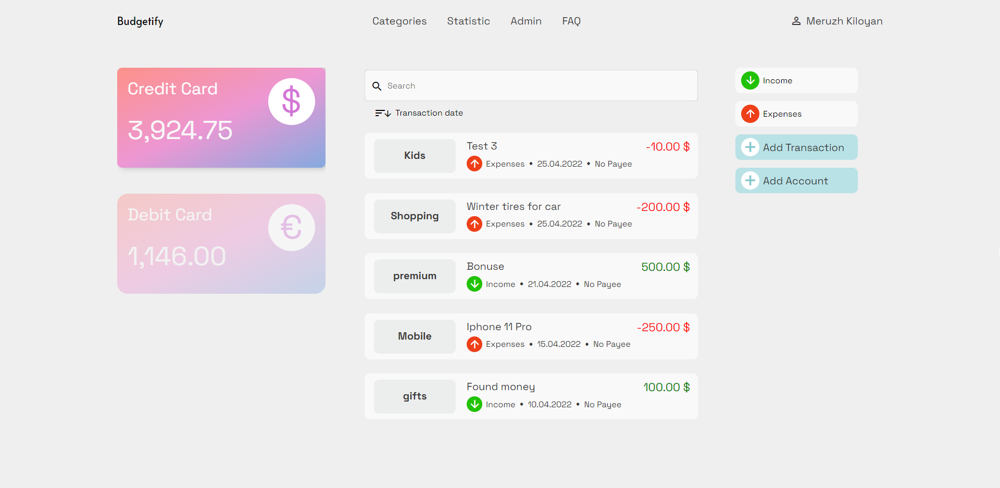

## Budgetify MVP

Budget Planning App is a web-application that allows you to: keep track of income and expenses in the context of various categories, set limits for expenses and get notifications when you spend too much, generate different types of reports with detailed cost analytics, organize the accounting of savings, store electronic copies of financial documents.

Budget planning application is for adults who care about their financial state, want to know where they spend money



## Tech Stack

**Client:** Angular, RxJS, Typescript, Angular Material

**Server:** Node, Express, JWT, Passport, Mongoose, Supertest


## Contributing

Contributions are always welcome!


## Installation

Install Budget-app with git:

```bash
  git clone https://github.com/coder-do/Budget-app.git
  cd Budget-app
```

## Environment Variables

To run this project on the `server`, you will need to add the following environment variables to your .env file

`PORT` - port to run the server on

`JWT_EXPIRES_IN` - time in seconds for JWT to expire

`JWT_SECRET` - secret for JWT

`SESSION_SECRET` - secret for session

`MONGODB_URL` - url for mongoDB

`MONGODB_URL_TESTS` - url for mongoDB in tests


## Running Tests

To run tests, run the following command

```bash
  npm run test
```


## Building

To build this project run

```bash
  npm run build
```


## Authors

- [@coder-do](https://www.github.com/coder-do)

## 🔗 Links
[](https://www.linkedin.com/in/meruzh-kiloyan-05327917b/)

## License

[MIT](https://choosealicense.com/licenses/mit/)